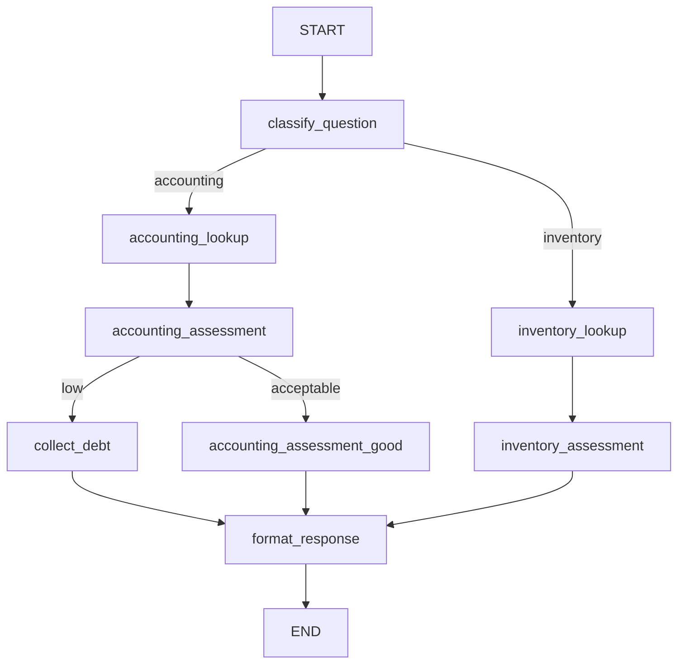

# 🤖 LangGraph Business Agent

A practice project demonstrating **LangGraph** concepts by building a business assistant that answers accounting and inventory questions using CSV data and a local/cloud LLM (Groq).

---

## 🎯 What this project demonstrates

This is a **learning-oriented** implementation of a LangGraph agent. It showcases:

| LangGraph Concept             | Implementation in this project                                                           |
| ----------------------------- | ---------------------------------------------------------------------------------------- |
| `StateGraph` & `MessageGraph` | Custom `AgentState` with typed fields                                                    |
| Nodes                         | Functions for classification, lookups, assessment, formatting                            |
| Conditional edges             | Routing by `classification` (accounting/inventory) and `llm_assessment` (low/acceptable) |
| Tool binding                  | `get_account_balance`, `get_overdue_customer_debt` with `bind_tools`                     |
| Parallel execution            | (Extendable with `Send` API – planned)                                                   |
| Subgraphs                     | (Separate accounting/inventory subgraphs – can be refactored)                            |
| Checkpointing                 | `MemorySaver` for state persistence (ready for `SqliteSaver`/`PostgresSaver`)            |
| Human‑in‑the‑loop             | `interrupt_before` + `update_state` for debt collection approval                         |
| Streaming                     | `stream_mode="updates"` to show intermediate results                                     |
| Testing                       | Unit tests for nodes + full graph simulation (see `tests/`)                              |
| Error handling                | Retries, fallback logic in tool execution                                                |

---

## 🧩 Business Use Case

A small business owner asks questions like:

- _"What is the status of our cash balance?"_
- _"Do we need to restock monitors?"_
- _"Check our payroll balance for a small shop"_

The agent:

1. Classifies the query (**accounting** or **inventory**)
2. Looks up data from CSV files (accounts, customers debt, inventory)
3. Calls a LLM (Groq) to assess the balance or recommend restocking
4. If the balance is `low`, it collects the most overdue customer debt and drafts a collection email
5. Returns a human‑friendly answer

---

## 🛠️ Tech Stack

- **LangGraph** – graph orchestration
- **LangChain** – tools, LLM integration
- **Groq** (or Ollama locally) – LLM for classification, assessment, email drafting
- **CSV** – data storage (accounts, customers debt, inventory)
- **Python** – 3.10+
- **uv / pip** – package management

---

## 🧠 Understanding the Graph Flow

-classify_question: LLM classifies query as accounting or inventory.

-accounting_lookup: Uses bind_tools to call get_account_balance (CSV lookup).

-accounting_assessment: LLM labels balance as low or acceptable.

-collect_debt: Fetches most overdue customer and drafts an email (using LLM).

-accounting_assessment_good: Provides narrative assessment for acceptable balances.

-inventory_lookup: Searches inventory CSV for the item.

-inventory_assessment: LLM advises on restocking based on min/current quantities.

-format_response: Formats final answer for display.
